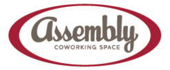



## [ Startup Calgary](startupcalgary.ca)
### Refreshments, Organization

Founded in 2010, Startup Calgary is an entrepreneur-led, volunteer-driven grassroots movement with the mission to activate startups, connect founders and grow the local startup ecosystem. We do this by partnering with the best resources, both in and out of Calgary, to run fantastic events and programs. We are constantly thinking of new ways to cultivate our great tech community and collaborate with the enormous amount of (often hidden) talent here in Calgary. Reach out, grab a coffee with us and let us know how we can help you build and launch your startup.

---

## [ Clio](goclio.com)
### Refreshments, Pizza, Being Awesome

---

## [ Assembly Co-Working Space](assemblycs.com)
### Meeting Space

Coworking spaces are a great alternative for start-ups, small to mid-size businesses or those who want an interactive environment with like minded business people.

---

## [ Noria Technologies](http://noriatechnologies.com/)
### Long time supporter of the group.

Noria Technologies is a custom application development shop located in Calgary, Canada.